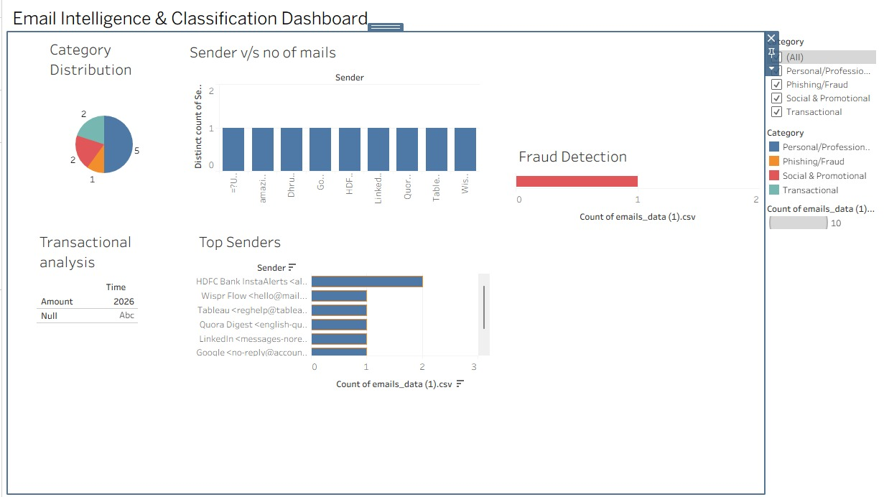

# Email Automation & Classification System

## Overview
This project automates email processing by:
- Reading emails using IMAP
- Extracting content and metadata
- Classifying emails into multiple categories
- Extracting financial transaction data
- Storing structured data for analysis

## Features
- Email classification (Spam, Fraud, Transactional, etc.)
- Transaction detection (₹ amounts, UPI)
- Automated hourly execution
- Logging system
- CSV data storage

## Tech Stack
- Python
- Pandas
- BeautifulSoup

## Setup

1. Install dependencies:
pip install -r requirements.txt

2. Set environment variables:

Windows:
setx EMAIL "your_email"
setx PASSWORD "your_app_password"

Linux/Mac:
export EMAIL="your_email"
export PASSWORD="your_app_password"

3. Run:
python main.py

## 📊 Dashboard Visualization

This dashboard was built using Tableau Public to analyze email data including classification, transaction trends, and fraud detection.

